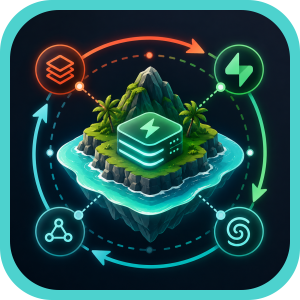
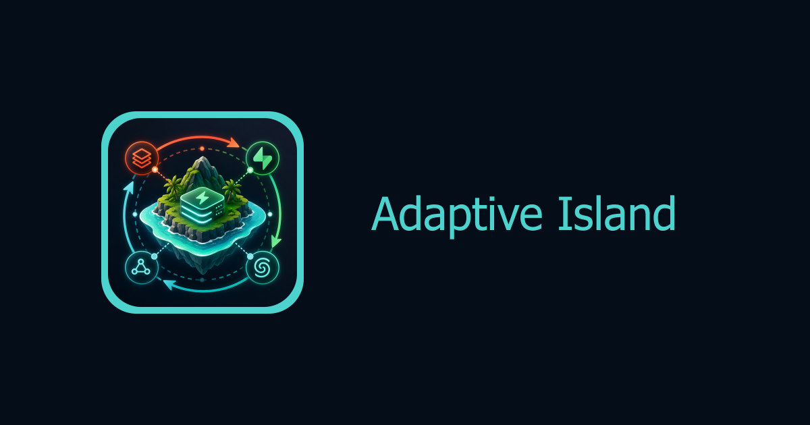

<div align="center">



# Adaptive Island

Cache-first provider selection engine for multi-provider inference workloads.

### Every workload makes the next workload smarter.

<br />

<strong>Project details</strong>

[](https://babysea.ai/blog/how-babysea-built-adaptive-provider-selection-on-databricks)
[](#babysea-oss-taxonomy)
[](#status)
[](LICENSE)

<br/>

<strong>Checks</strong>

[](https://gitlab.com/babysea/adaptive-island/-/commits/main)
[](https://github.com/babysea-community/adaptive-island/actions/workflows/codeql.yml)
[](https://github.com/babysea-community/adaptive-island/actions/workflows/package-check.yml)

<br/>

<strong>Built with</strong>

[](https://www.databricks.com)
[](https://supabase.com)
[](https://upstash.com)
[](https://spark.apache.org)
[](https://delta.io)
[](https://mlflow.org)

<br/>



</div>

<br/>

## BabySea OSS taxonomy

BabySea open source projects are organized into three categories:

[](#babysea-oss-taxonomy)
[](#babysea-oss-taxonomy)
[](#babysea-oss-taxonomy)

| Category      | Description                                                                                                                                       |
| :------------ | :------------------------------------------------------------------------------------------------------------------------------------------------ |
| **SDK**       | Typed developer entry points for creating, tracking, and managing BabySea workloads from application code.                                        |
| **Primitive** | Reusable infrastructure boundaries extracted from BabySea's execution control plane. Each primitive focuses on one system concern.                |
| **Starter**   | Deployable reference applications that combine product UI, auth, storage, and BabySea execution patterns. Some starters may also include billing. |

## Status

BabySea OSS projects are published into three status levels:

[](#status)
[](#status)
[](#status)

| Status         | Description                                                                                                                                                                          |
| :------------- | :----------------------------------------------------------------------------------------------------------------------------------------------------------------------------------- |
| **Working**    | Fully implemented and deployable. All documented capabilities function as described. Suitable for personal and small-team use. No breaking-change guarantees between versions.       |
| **Production** | Working plus a hardened public runtime contract. Validated against a stated infrastructure stack with deterministic behavior, explicit failure modes, and a documented upgrade path. |
| **Alpha**      | Early-stage implementation. Core structure exists but some capabilities may be incomplete, undocumented, or subject to breaking changes. Not recommended for production deployments. |

See [`CHANGELOG.md`](CHANGELOG.md) to track releases and public contract changes.

## Table of contents

1. [Overview](#1-overview)
    - [What this is](#what-this-is)
    - [Short version](#short-version)
    - [Production lineage](#production-lineage)
    - [Grounding rule](#grounding-rule)
    - [Adoption path](#adoption-path)
2. [Stack contract](#2-stack-contract)
3. [Terminology](#3-terminology)
4. [Boundaries](#4-boundaries)
5. [Architecture](#5-architecture)
6. [Quick start](#6-quick-start)
    - [Create the Supabase source table](#create-the-supabase-source-table)
    - [Deploy on Databricks](#deploy-on-databricks)
    - [Use the TypeScript SDK](#use-the-typescript-sdk)
    - [Use the Python SDK](#use-the-python-sdk)
    - [Validate against real services](#validate-against-real-services)
7. [Core capabilities](#7-core-capabilities)
    - [Why it's different](#why-its-different)
    - [The source event you log](#the-source-event-you-log)
    - [The cache value you read](#the-cache-value-you-read)
    - [Runtime selection flow](#runtime-selection-flow)
    - [Fail-open by design](#fail-open-by-design)
8. [Version surface](#9-version-surface)
9. [Security and Compliance](#10-security-and-compliance)
10. [Community](#11-community)
    - [Who's using it](#whos-using-it)
    - [Related projects](#related-projects)
    - [Contributing](#contributing)
11. [License](#12-license)

---

## 1. Overview

### What this is

`adaptive-island` is a cache-first provider selection primitive for multi-provider inference workloads. Your runtime logs provider attempts to Supabase, Databricks computes provider rankings offline, Upstash serves the latest ranking, and the SDK turns that cache value into an ordered provider list.

The package keeps Databricks off the request path. Runtime code reads one cache key, validates the payload, filters it against allowed providers, and falls back to a deterministic order whenever the cache cannot be trusted.

### Short version

Provider performance changes constantly. `adaptive-island` lets every workload improve later routing while the current request remains simple: read Upstash, validate, rank, and fail open.

### Production lineage

The architecture mirrors BabySea's production provider-ranking loop behind `generation_provider_order: "fastest"`. The public repo uses neutral names and community-owned infrastructure, but the shape stays the same: Supabase attempt logs, Databricks Bronze/Silver/Gold computation, Gold export to Upstash, and SDK-side validation before dispatch.

### Grounding rule

Public OSS behavior is limited to the Databricks -> Upstash -> Supabase ranking loop implemented here. Supabase attempt logs, Databricks ranking jobs, Upstash cache export, cache-first SDK validation, and deterministic fail-open behavior are in scope. Request-path Databricks serving, online exploration, queues, hosted APIs, provider SDK calls, and private BabySea catalogs are out of scope.

### Adoption path

If you operate a multi-provider inference stack, log one provider-attempt row per dispatch attempt, deploy the Databricks bundle, export rankings to Upstash, and call the SDK from your runtime with an explicit fallback provider order. You bring Databricks, Supabase, Upstash, and your provider clients. The island handles cached ranking.

## 2. Stack contract

| Layer                  | Required stack                                                         | Runtime responsibility                                                                                      |
| :--------------------- | :--------------------------------------------------------------------- | :---------------------------------------------------------------------------------------------------------- |
| Operational source     | Supabase `provider_cost_log`                                           | Store one row per provider attempt with outcome, timestamps, cost estimate, region, model, and attempt order. |
| Learning path          | Databricks Lakehouse Federation, Lakeflow, Delta Lake, Unity Catalog   | Read Supabase into Bronze/Silver/Gold tables and compute one ranking artifact per `(model, region)`.        |
| Offline model training | Databricks MLflow                                                      | Train and evaluate ranking/value models from Silver attempts without becoming a request-path dependency.     |
| Serving cache          | Upstash                                                                | Store `predictive:ranking:<region>:<model>` payloads with a TTL longer than the export cadence.             |
| Application runtime    | TypeScript or Python SDK                                               | Read one cache key, validate the payload, filter providers, and fail open to the caller fallback.            |

No other data platform, queue, search index, online-exploration service, or hosted inference gateway is part of this version contract.

Production-grade means the shipped runtime contract is deterministic and ready for the stated stack:

- Supabase is the operational source of truth for provider attempts.
- Databricks is the learning path, not the request path.
- Upstash is the serving cache for the Gold ranking payload.
- Region isolation is explicit; use separate regional resources for production `us`, `eu`, `apac`, or your own labels.
- Secrets live in Supabase, Databricks, Upstash, or deployment secret managers and never appear in ranking payloads.
- Breaking data-contract changes require new schema versions instead of mutating `attempt.v1` or `ranking.v1` in place.

## 3. Terminology

| Term                    | Meaning in this package                                                                                                           |
| :---------------------- | :-------------------------------------------------------------------------------------------------------------------------------- |
| Provider attempt        | One submitted call to an inference provider. A single generation can produce multiple attempts when failover happens.              |
| Wasted attempt          | An attempt with `failed`, `discarded`, or `cancelled` outcome. It may still carry provider cost, so it lowers ranking score.       |
| Databricks Gold ranking | The deterministic Databricks output exported to Upstash. It is the default production routing artifact.                            |
| Upstash ranking key     | A cache entry named `predictive:ranking:<region>:<model>` containing the Gold ranking payload.                                     |
| Fallback order          | The explicit provider list your runtime passes to the SDK. It is returned whenever cache validation or connectivity fails.         |
| Value model             | Optional MLflow model trained from Silver attempts for offline analysis and promotion review. It is never required on the request path. |

## 4. Boundaries

- Not a provider router, hosted inference gateway, or provider SDK wrapper.
- Not a request-path Databricks dependency.
- Not a stochastic online-exploration or propensity-logging system.
- Not an off-policy promotion gate or managed ML platform.
- Not an alternate warehouse/cache abstraction; this version is Databricks + Supabase + Upstash.
- Not BabySea's private routing catalog, provider credentials, or production telemetry.
- Not production Docker Compose; local demos are developer smoke stacks only.

## 5. Architecture

```text
Supabase provider_cost_log
        |  Lakehouse Federation
        v
Databricks Bronze provider attempts
        v
Databricks Silver typed attempts
        v
Databricks Gold provider ranking by model and region
        |  Lakeflow export job
        v
Upstash predictive:ranking:<region>:<model>
        |
        v
SDK/API rank() -> provider failover loop
```

The default ranking is intentionally explainable:

```text
score = success_rate     * 1.0
      - wasted_rate      * 0.5
      - latency_p95_norm * 0.3
```

The default window is 24 hours, and the default cache TTL is 48 hours. See [`docs/scoring-config.md`](docs/scoring-config.md) for scoring configuration and [`docs/evaluation-metrics.md`](docs/evaluation-metrics.md) for synthetic evaluation guidance.

## 6. Quick start

### Create the Supabase source table

Run the example table in your Supabase SQL editor, or adapt your existing log with a view:

- New source table: [`examples/supabase-provider-cost-log/provider_cost_log.sql`](examples/supabase-provider-cost-log/provider_cost_log.sql)
- Existing log adapter: [`examples/adopt-existing-log/`](examples/adopt-existing-log)

The required operational shape is documented in [`schemas/attempt.v1.json`](schemas/attempt.v1.json). Databricks source tables or adapter views must expose `id` for Bronze lineage and de-duplication. For required fields, optional fields, outcomes, timestamp semantics, and region/model normalization rules, see [`docs/data-contract.md`](docs/data-contract.md).

### Deploy on Databricks

```bash
git clone https://github.com/babysea-community/adaptive-island
cd adaptive-island/examples/databricks-asset-bundle

export DATABRICKS_HOST="https://<your-workspace>.cloud.databricks.com"
export DATABRICKS_TOKEN="<your-token>"

# Store the Upstash URL in a Databricks secret scope first.
# Pass only the non-secret scope/key names to the bundle.
databricks bundle validate --target prod \
  --var catalog=adaptive_island_us \
  --var region=us \
  --var federation_connection=<your_federated_catalog> \
  --var cache_url_secret_scope=adaptive-island-prod \
  --var cache_url_secret_key=upstash-cache-url

databricks bundle deploy --target prod \
  --var catalog=adaptive_island_us \
  --var region=us \
  --var federation_connection=<your_federated_catalog> \
  --var cache_url_secret_scope=adaptive-island-prod \
  --var cache_url_secret_key=upstash-cache-url
```

See [`docs/deploy-on-databricks.md`](docs/deploy-on-databricks.md) for the full sequence and [`docs/routing-lifecycle.md`](docs/routing-lifecycle.md) for the lifecycle from attempt logs to cache reads.

### Use the TypeScript SDK

Install the SDK from source until the npm package is published:

```bash
cd client/typescript
npm install
npm run build

cd /path/to/your-app
npm install /path/to/adaptive-island/client/typescript
```

```typescript
import { Selector, resolveAdaptiveRoutingEnabled } from 'adaptive-island';

const selector = new Selector({
  cache: {
    async get(key) {
      return await yourUpstashClient.get(key);
    },
  },
  maxCacheAgeSeconds: 48 * 60 * 60,
  adaptiveRoutingEnabled: resolveAdaptiveRoutingEnabled(
    process.env.ADAPTIVE_ROUTING_ENABLED,
  ),
});

const providers = await selector.rank({
  modelId: 'black-forest-labs/flux-schnell',
  region: 'us',
  fallback: ['replicate', 'fal', 'cloudflare'],
});
```

Try `providers[0]` first, then fail over through the rest in order.

### Use the Python SDK

Install the SDK from source until the PyPI package is published:

```bash
cd client/python
pip install -e .
```

```python
from adaptive_island import Selector

selector = Selector(
    cache_url="redis://default:<token>@<host>:6379",
    max_cache_age_seconds=48 * 60 * 60,
)

providers = selector.rank(
    model_id="black-forest-labs/flux-schnell",
    region="us",
    fallback=["replicate", "fal", "cloudflare"],
)
```

If adaptive routing is disabled, cache data is unavailable, or payload validation fails, `rank()` returns the caller-provided fallback after removing duplicate providers.

### Validate against real services

Run the reusable smoke harness from a temporary checkout or CI job after setting Databricks, Supabase, and Upstash credentials as environment variables. It creates a disposable Supabase schema, writes a short-lived Upstash ranking key, verifies Databricks API access, and runs the SDK against the cache without printing secrets.

See [`examples/real-stack-smoke/`](examples/real-stack-smoke) for the exact environment variables and cleanup behavior. For a credentials-free walkthrough, see [`examples/local-synthetic-demo/`](examples/local-synthetic-demo).

## 7. Core capabilities

### Why it's different

Provider ranking needs to learn, but the learning system should not be able to block a request. `adaptive-island` separates the slow path from the hot path: Supabase logs attempts, Databricks learns offline, Upstash serves the compact result, and the SDK fails open.

| Problem                                  | How `adaptive-island` solves it                                                                                          |
| :--------------------------------------- | :----------------------------------------------------------------------------------------------------------------------- |
| **Provider rankings drift.**             | Recent attempt logs feed a Bronze/Silver/Gold pipeline that recomputes rankings from success, waste, and latency.        |
| **Learning systems are risky live.**     | Databricks never sits on the request path; runtime reads one Upstash key and falls back on any issue.                    |
| **Routing needs regional isolation.**    | Rankings are exported per `(model, region)`, with isolated regional resources recommended for production.                |
| **Malformed cache payloads are unsafe.** | SDKs validate shape, finite scores, timestamps, provider allowlists, TTL, and optional max-age before returning a ranking. |
| **Operators need explanations.**         | The default score is explicit and documented instead of hidden behind a black-box router.                                |

### The source event you log

```jsonc
{
  "schema_version": "attempt.v1",
  "generation_id": "gen_01JK0...",
  "account_id": "acct_123",
  "model": "black-forest-labs/flux-schnell",
  "provider": "replicate",
  "provider_model_id": "black-forest-labs/flux-schnell",
  "prediction_id": "pred_abc",
  "estimated_cost": 0.0023,
  "outcome": "used",
  "attempt_order": 1,
  "was_cancelled": false,
  "cancel_available": true,
  "submitted_at": "2026-04-29T14:22:08Z",
  "resolved_at": "2026-04-29T14:22:11Z",
  "error_message": null,
  "metadata": {}
}
```

### The cache value you read

Key:

```text
predictive:ranking:us:black-forest-labs/flux-schnell
```

Value:

```json
{
  "providers_ranked": ["replicate", "fal", "cloudflare"],
  "scores": {
    "replicate": 0.81,
    "fal": 0.42,
    "cloudflare": -0.05
  },
  "attempts_total": 137,
  "window_hours": 24,
  "computed_at": "2026-04-29T02:31:15Z"
}
```

This is the runtime contract. The SDK rejects missing providers, non-finite scores, invalid timestamps, stale payloads, unsupported providers, and malformed JSON.

### Runtime selection flow

1. Normalize the requested `modelId` and `region`.
2. Build the Upstash key `predictive:ranking:<region>:<model>`.
3. Return fallback immediately when adaptive routing is disabled.
4. Read and parse the cached ranking payload.
5. Validate schema, scores, `computed_at`, and optional max age.
6. Remove providers that are not in the caller fallback/allowlist.
7. Return ranked providers that also appear in the fallback/allowlist; if none remain, return the fallback order.

### Fail-open by design

| Failure                                             | Behavior                                                   |
| :-------------------------------------------------- | :--------------------------------------------------------- |
| Databricks paused or export job fails               | Upstash keeps serving the last ranking until TTL expires.  |
| Upstash unavailable                                 | SDK returns the caller-provided fallback order.            |
| Ranking missing, malformed, TTL-expired, or too old | SDK returns the caller-provided fallback order.            |
| Adaptive routing disabled                           | SDK skips cache reads and returns fallback directly.       |
| Provider down                                       | Caller fails over through the ordered provider list.       |

Databricks improves later requests, but it is not required to serve the current one. See [`docs/testing-failure-modes.md`](docs/testing-failure-modes.md) for failure modes that should remain covered in tests.

## 8. Version surface

Current version surface:

- [x] Supabase `provider_cost_log` source contract
- [x] Databricks Bronze/Silver/Gold Lakeflow pipeline on Delta Lake
- [x] Gold-to-Upstash export job
- [x] Cache-first TypeScript and Python SDKs
- [x] Adaptive-routing runtime toggle that can skip cache reads
- [x] Optional offline MLflow value-model training entry point
- [x] Databricks Asset Bundle deploy path
- [x] Real-stack smoke harness for Databricks, Supabase, and Upstash

New features stay out of the public contract until they are implemented, documented, and validated against this stack.

## 9. Security and Compliance

The project publishes its trust signals through public GitHub, GitLab, or other CI provider checks so contributors can inspect the actual CI configuration, jobs, and reports.

## 10. Community

### Who's using it

- **[BabySea](https://babysea.ai)**: execution control plane for generative media.

*Using `adaptive-island`? Open a PR to add yourself.*

### Contributing

We welcome PRs, issues, and design discussion. See [`CONTRIBUTING.md`](CONTRIBUTING.md), [`CODE_OF_CONDUCT.md`](CODE_OF_CONDUCT.md), and [`SECURITY.md`](SECURITY.md).

## 11. License

[Apache License 2.0](LICENSE). Use it, fork it, ship it.
